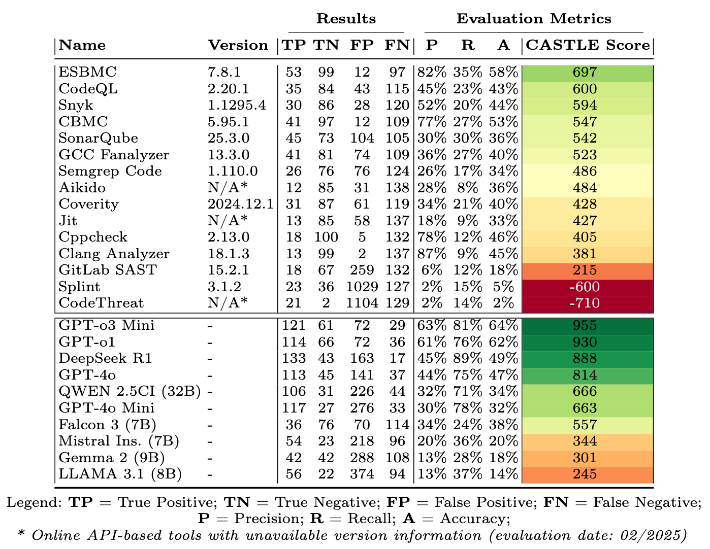
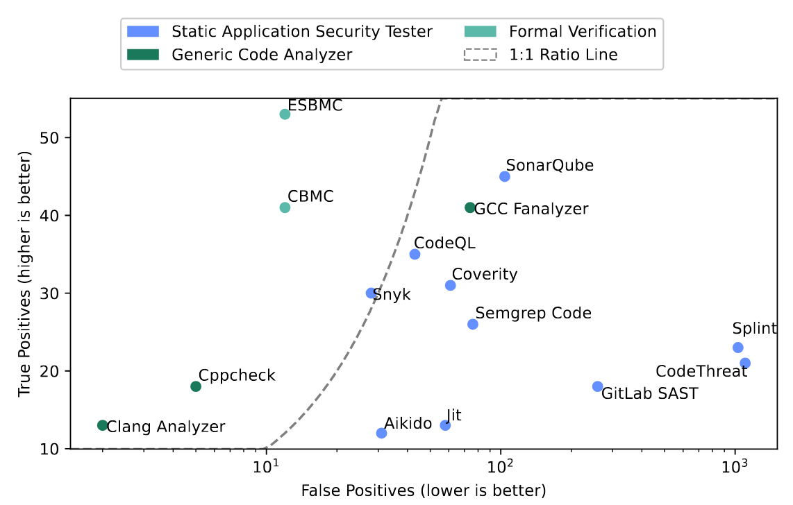

# CASTLE Benchmark

<div align="center">
    
</div>

The __CASTLE Benchmark__ is a comprehensive dataset and a scoring method for evaluating single or combinations of __static analyzers__ with a focus on security. It consists of a hand-crafted dataset of __250__ micro-benchmark programs (almost 11,000 lines of C code), covering __25__ common __CWEs__. We also introduce the novel __CASTLE Score__ metric to enable fair and reliable comparisons, considering factors such as true positive and false positive rates, as well as the tools' ability to find more common issues. This dataset enables a comparison of single tools, as well as the effectiveness of tool combinations.

This dataset was created by Richard A. Dubniczky, Krisztofer Zoltan Horvát, Tamás Bisztray,
Mohamed Amine Ferrag, Lucas C. Cordeiro, and Norbert Tihanyi as a joint research project and it is currently under peer-review.

Paper preprint is available at: [arxiv.org](https://arxiv.org/abs/2503.09433)

## Citing the Paper

```bibtex
@misc{dubniczky2025castle,
    title={CASTLE: Benchmarking Dataset for Static Code Analyzers and LLMs towards CWE Detection}, 
    author={Richard A. Dubniczky and Krisztofer Zoltán Horvát and Tamás Bisztray and Mohamed Amine Ferrag and Lucas C. Cordeiro and Norbert Tihanyi},
    year={2025},
    eprint={2503.09433},
    archivePrefix={arXiv},
    primaryClass={cs.CR},
    url={https://arxiv.org/abs/2503.09433}, 
}
```

## The Complete Dataset

- [CASTLE-C250.json](./datasets/CASTLE-C250.json) - The parsed and labeled dataset with 250 tests in C language.
- [CASTLE-C250.min.json](./datasets/CASTLE-C250.min.json) - The minified version parsed and labeled dataset with 250 tests in C language. It contains everything from the non-minimized version but it's less readable: recommended for automated use.
- [CASTLE-C250](./datasets/CASTLE-C250) - All 250 tests in C language in individual C files with an accompanied Makefile.
- [CASTLE-Source](https://github.com/CASTLE-Benchmark/CASTLE-Source) - The source code repository for the CASTLE Dataset, Tests, Wrappers, Evaluators, Diagrams and more ...


## Architecture


The CASTLE Architecture consists of 4 main stages:

1. We selected the tested CWEs, created the dataset of tests and labelings and validated the correctness of the C code over many iterations using expert review, static analyzers, formal verification methods, and LLMs. The final result from this step is the dataset JSON file.
2. In the second step we created wrappers for all tools to automate the evaluation as much as possible. For some open-source tools this means running the tests in a container in sequence, while for others we had to access APIs or manually download the results and parse them afterwards. The output of this step is an report JSON file in a custom common format.
3. In the manual review phase we looked at all the ~7,500 findings and validated our TP and FP classifications. Some tools marked a different line or CWE than our tests indicate, and in those cases we set our classification accordingly and updated our tests. We ran these tests on the tools at least 3 times between Nov 2024 and Feb 2025 with the updated dataset.
4. We evaluated the findings and calculated the CASTLE Score for single tools and tool combinations, as well as generated our final toplists and charts.

## Results

We tested a total of 25 tools (13 static analyzers, 2 formal verification tools, 10 LLMs) on the CASTLE C250 Dataset. The results from the top 250 tests and their CASTLE Scores ordered by their CASTLE Score:




Barchart comparing the CASTLE Scores of the individual tools and the best 5 tool combinations. The theiretical maximum score is 1250, while the negative is unlimited, as all false positives subtract points.


True vs False Positive rates of the tools:




## Additional Charts

List of CWEs in the dataset


Strengths of LLMs vs Static Analyzers based on the standard metrics.


Comparing the CASTLE Score of tool combinations vs the better individual tool scores


True positive count for each tool per CWE


Venn diagram of specific vulnerabilitites detected by the best three-way CASTLE score. The smaller the intersections, the higher the improvement in CASTLE scores given a limited amount of false positives.


